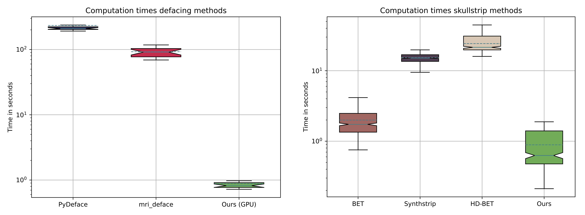

# Holistic Deidentification in Radiology (HolDeR)

[](https://www.python.org/downloads/release/python-3120/) 
[](https://github.com/psf/black)
[](./LICENSE)

<div align="center">

[Getting started](#getting-started) • [Usage](#usage) • [Citation](#citation)

</div>

This repository contains the **De-Identification of Medical Imaging Data: A Comprehensive Tool for Ensuring Patient Privacy**, which enables the user to anonymize a wide variety of medical imaging types, including Magnetic Resonance Imaging (MRI), Computer Tomography (CT), Ultrasound (US), Whole Slide Images (WSI) or MRI raw data (twix).

AAM combines multiple anonymization steps, including metadata deidentification, defacing and skull-stripping while being faster than current state-of-the-art deidentification tools.



## Getting started

You can install the anonymization tool either directly via git, by cloning this repository or via Docker. 

### Installation via Git

1. Clone repository:
   
       git clone ...

2. Create a conda environment with Python version 3.12.4 and install the necessary dependencies:
   
       conda create -n my_env python=3.12.4 --file requirements.txt
    In case of installation issues with conda, use pip install -r requirements.txt to install the dependecies.

3. Activate your new environment:

       conda activate my_env

4. Run the script with the corresponding cli parameter, e.g.:

       python3 deidentify.py [your flags]

### Installation via Docker
Alternatively this tool is distributed via docker. You can find the docker images [here](https://hub.docker.com/repository/docker/morrempe/aam/general). The docker image is available for amd64 and arm64 platforms. 

For the installation and execution of the docker image, you must have [Docker](https://docs.docker.com/get-docker/) installed on your system.

1. Pull the docker image

       docker pull morrempe/hold:[tag]   (either arm64 or amd64)

2. Run the docker container with attached volume. Your data will be mounted in the ````data```` folder:

       docker run --rm -it -v [Path/to/your/data]:/data morrempe/hold:[tag]

3. Run the script with the corresponding cli parameter, e.g.:

       python3 deidentify.py [your flags]

## Usage
**Twix Anonymization CLI**
```
usage: deidentify.py [-h] [-v | --verbose | --no-verbose] [-t | --text-removal | --no-text-removal] [-i INPUT]
                                    [-o OUTPUT] [--gpu GPU] [-s | --skull_strip | --no-skull_strip] [-de | --deface | --no-deface]
                                    [-tw | --twix | --no-twix] [-p PROCESSES]
                                    [-d {basicProfile,cleanDescOpt,cleanGraphOpt,cleanStructContOpt,rtnDevIdOpt,rtnInstIdOpt,rtnLongFullDatesOpt,rtnLongModifDatesOpt,rtnPatCharsOpt,rtnSafePrivOpt,rtnUIDsOpt} [{basicProfile,cleanDescOpt,cleanGraphOpt,cleanStructContOpt,rtnDevIdOpt,rtnInstIdOpt,rtnLongFullDatesOpt,rtnLongModifDatesOpt,rtnPatCharsOpt,rtnSafePrivOpt,rtnUIDsOpt} ...]]

options:
  -h, --help            show this help message and exit
  -v, --verbose, --no-verbose
  -t, --text-removal, --no-text-removal
  -i INPUT, --input INPUT
                        Path to the input data.
  -o OUTPUT, --output OUTPUT
                        Path to save the output data.
  --gpu GPU             GPU device number. (default 0)
  -s, --skull_strip, --no-skull_strip
  -de, --deface, --no-deface
  -tw, --twix, --no-twix
  -w, --wsi, --no-wsi
  -p PROCESSES, --processes PROCESSES
                        Number of processes to use for multiprocessing.
  -d {basicProfile,cleanDescOpt,cleanGraphOpt,cleanStructContOpt,rtnDevIdOpt,rtnInstIdOpt,rtnLongFullDatesOpt,rtnLongModifDatesOpt,rtnPatCharsOpt,rtnSafePrivOpt,rtnUIDsOpt} [{basicProfile,cleanDescOpt,cleanGraphOpt,cleanStructContOpt,rtnDevIdOpt,rtnInstIdOpt,rtnLongFullDatesOpt,rtnLongModifDatesOpt,rtnPatCharsOpt,rtnSafePrivOpt,rtnUIDsOpt} ...], --deidentification-profile {basicProfile,cleanDescOpt,cleanGraphOpt,cleanStructContOpt,rtnDevIdOpt,rtnInstIdOpt,rtnLongFullDatesOpt,rtnLongModifDatesOpt,rtnPatCharsOpt,rtnSafePrivOpt,rtnUIDsOpt} [{basicProfile,cleanDescOpt,cleanGraphOpt,cleanStructContOpt,rtnDevIdOpt,rtnInstIdOpt,rtnLongFullDatesOpt,rtnLongModifDatesOpt,rtnPatCharsOpt,rtnSafePrivOpt,rtnUIDsOpt} ...]
                        Which DICOM deidentification profile(s) to apply. (default None)
```

## Citation

If you use our tool in your work, please cite us with the following BibTeX entry.
```latex

```

